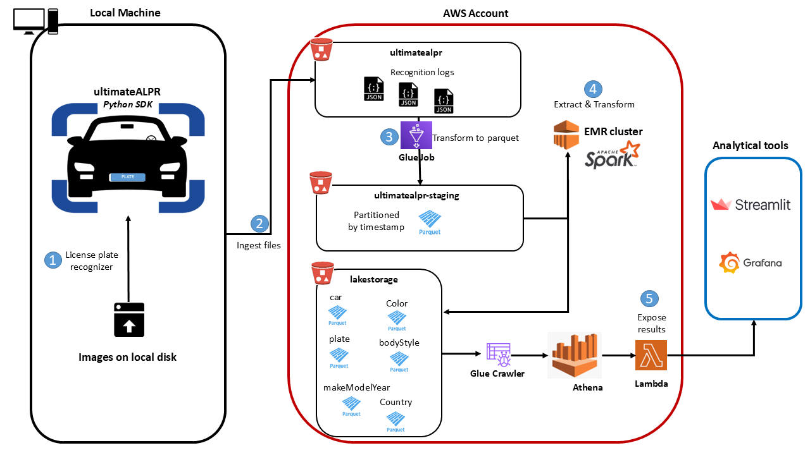
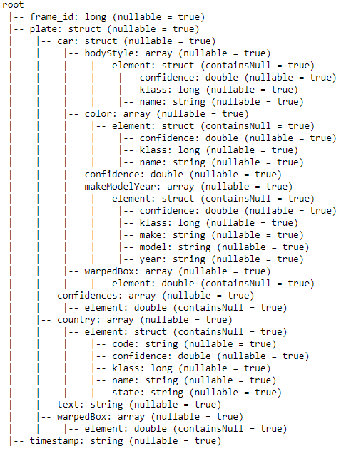
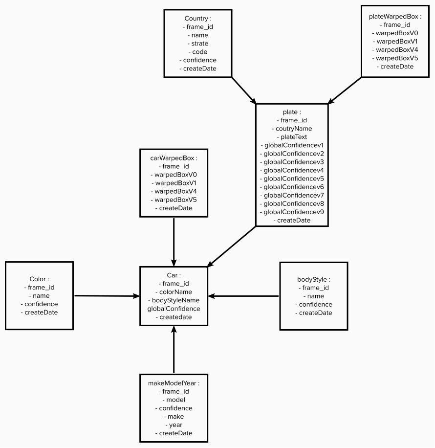
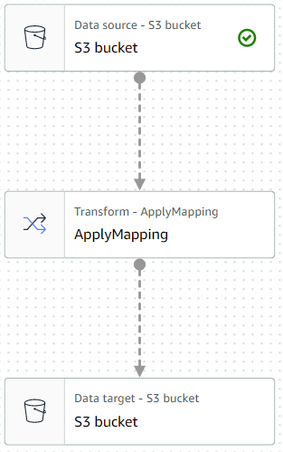
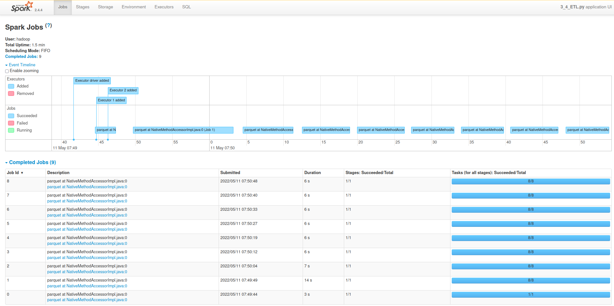

# ultimateALPR : proceed ETL nested json files with AWS S3, Glue Crawler and Spark

Doubango AI is a company that build artificial intelligence solutions and apps using state of the art deep learning and computer vision technologies. Providing 3D Face liveness check (anti-spoofing), ANPR/ALPR, MRZ/MRTD, ScanToPay, MICR, CBIR, ICR, OCR, SceneText for smart cities solutions.

The Users Support team of Doubango AI need to analyze after effect the incidences or events. 
This Analysis could be done via dishoarding solutions (Grafana, Tableau …) or via web application.

The Users support team would like also to know the performance and the cost in daily basis, that could help the company to decide with solution are efficient and how to improve it.

## Demarche and steps 
We have 2 modes to process the recognition of the cars, streaming or batch mode. In for the moment, we chose the batch mode. 
To achieve this task, we will following this steps:

  

1-	License Plate Recognition: We assume this step will not be covered in this topic, but we will use it for diagram understanding
-	collect the images: 251,526 images, each picture could have 1 or more car, trunks or motorcycle
-	process license plate recognizer with the python SDK. This will give us 251,526 json files to store in local disk (no FS or HDFS)

2-	[Ingest json files from local](https://github.com/Iaddiop/ultimateALPR_data_extraction/blob/master/Ingest_Files_from_local_to_s3.py) to a S3 bucket `ultimatealpr`

3-	Transform json files to parquet format, by using AWS Glue Crawler

4-	Extract and transform data with spark on EMR cluster

5-	Load result of the ETL in the S3 lakestorage bucket

6-	Data validation and data quality check

## Data modeling : why chosing a data lake storage instead a DWH ?
1-  data structured 
The json structure given by the log json file are deeply nested like this :

  

In our case we will explode the data in set of file to parquet format, and then we could infer with the schema on demand :

  

2-  Costs:
If we have chosed DWH technology, in our case we will chose a database solution (Redshift, DynamoDB ...) and a EC2 machine to process data. 
This strategy will be more effect cost than chosing S3 bucket storage and EMR cluster to process ower Spark script to do the ETL.

3-  Schema on read:
Combining storage on S3 and Spark, it's easy to work and process files without creating database and save the result files in parquet format.
Parquet format allow us to inferre with files as a schema of a database, but the data remain in a file and we could read them following a specifique schema on demand.

4-  Changing structure:
The ultimateAlPR output could change, update or delete some structure in the json log files.

## How to run this project :
To run this project, please following the below steps :

1-  Configure a Glue job to convert json log files to parquet :

  

Set :
-   data source : `ultimatealpr` bucket
-   data target : `ultimatealpr-staging` bucket
-	chose : spark for the type of ETL
-	use 10 workers(G.1 x type) for the transformation
-	store parquet files portioned by timestamp : output 141 blocks.

2-  Create EMR cluster
-	chose EMR cluster instance type : m5.xlarge (more than enough)
-   with 3 cores (1 driver and 2 executors)
-   copy and paste the `ETL.py` script and your `.pem` key to the EMR cluster at home directory
-	submit the ETL spark job in the cluster (we chose `yarn` as cluster manager)

3-  Data validation 
We have 2 ways to validate de quality of the data and check results:
-   Glue crawler --> Glue catalogue --> SQL query with Athena
-   Or directely read parquet files from `ultimatealpr-staging` bucket in jupyter notebook with spark
We decide to proceed with the validation in jupyther notebook `Test.ipynb`

## Performances and cost effect :
1-	License plate recognizer : local machine, we don't mesure the performence for this step

2-	Ingest json files from local to a S3 bucket `ultimatealpr` 
-   took hours (process will be improved in the future : Data Sync, HDPS in local)
-   S3 services
    -   Put : $2,21 for 401,515 Requests ($0.0055 per 1,000 requests)
    -   Get : $2.44 for 5,549,535 Requests ($0.0044 per 10,000 requests)

3-	Glue job to transform json file to parquet
-	the job took 9 minutes
-	used 1.48 DPU hours
-   cost : $0,65 ($0.44 per DPU)

4-5	ETL with spark on EMR cluster:
-	the spark job took 1.4 minutes
-   cost : $0.048 per hour for EMR m5.xlarge
-   there was 8 jobs each one took less than 13 seconds, see below the spark job in sparkUI :

  

## Data validation and data dictionary:

1-  Data validation
There are 266440 rows in each bolw files :

**- bodyStyle**

**- color** 

**- makeModelYear**

**- carWarpedBox** 

**- car** 

**- country** 

**- plateWarpedBox** 

There are 245155 rows in below file :

**- plate** 

2-  Data dictionary

## Future improvements :
-   Live recognition with camera
-   Ingest data from local to S3 bucket in streaming mode or with AWS DataSync to automate moving data between on premise to S3.
-   Configure Glue job to parse data by event in S3 data sources bucket to the staging area `ultimatealpr-staging` bucket
-   Add new feature in the ultimateALP application to assign the position of the recognition (country, state …). These features allow us to centralize the analysis or to dispatch data in buckets by area

All this improvements will be defined with Doubango AI analysis departement and User support team.

## Future scenarios
-   In the `ultimatealpr` S3 bucket the data going to increase, but the analytical rules need 1 month data storage. In the scenario the data increas by 100x (events: Black Friday, charismas, sales discount period):
    -   1 month data retention will be needed 
    -   1 years archive in S3 Glacier (storing archives, data retrieval, event notifications) 
    -   Set Glue job to automatically scale the number of workers
-	The pipelines would be run on a daily basis by 7 am every day to run the analysis dashboards (Streamlit for example) : 
    -   Airflow could be used to run the pipeline to populate the dashboard
    -   Daily data quality check could be performed end send email to the user support team and the Data engineering team for the monitoring
-	The S3 policy could be extend to allow permission and could be accessible by 100+ people. In the case of Dubango AI as the data could be centralized or dispatched for each localities, the accessibility of the data depend of this strategy (centralized or decentralized) and set up the buckets by area or not.

### References :
- [ultimateALPR](https://github.com/DoubangoTelecom/ultimateALPR-SDK)
- [Convert CSV / JSON files to Apache Parquet using AWS Glue](https://medium.com/searce/convert-csv-json-files-to-apache-parquet-using-aws-glue-a760d177b45f)
- [How to choose an appropriate file format for your data pipeline](https://medium.com/@montadhar/how-to-choose-an-appropriate-file-format-for-your-data-pipeline-69bbfa911414)

 
