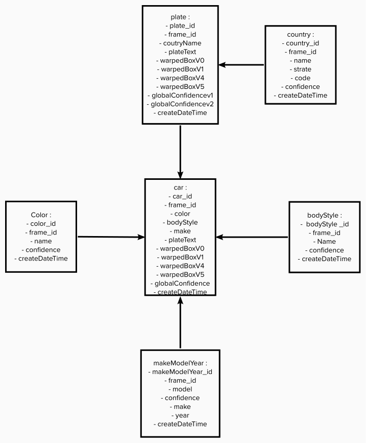

# ultimateALPR data lake in AWS S3 with AWS Glue Crawler AWS EMR cluster and Spark

DoubangoAI is a company that builds artificial intelligence solutions and apps using the newest deep learning and computer vision technologies. Providing 3D Face liveness check (anti-spoofing), ANPR/ALPR, MRZ/MRTD, ScanToPay, MICR, CBIR, ICR, OCR, SceneText for smart cities solutions.

Some user’s feedbacks would like to analyze the output logs of the ANPR/ALPR solution. To achieve this task, the support team needs to build an analysis solution to visualize events or expose the results of the detection plates via API.

Before to build the analytical solution, the output logs of ANPR/ALPR need to be processed, transform and stored.

We chose the AWS technologies batch processing, to extract, transform store the data.

## Steps to perform car plate recognition, extract information, transform and store data

After recognition of the images by ultimateALPR, The log files are in local machine and will be loaded in Amazon S3 bucket, then we will process the ETL on EMR cluster and finally store the results to a datalake in a S3:

  

1- License Plate Recognition: We assume this step will not be covered in this topic, but we will use it for diagram understanding:
- Collect the images: each picture could have one or several cars, trucks or motorcycles
- Process license plate recognizer with python SDK. This will give us as many JSON log files as images to store in local disk or in local operating system

2- Load JSON log files from local to `ultimatealpr` S3 bucket.

3- Transform JSON log files from `ultimatealpr` S3 bucket to Parquet format by using AWS Glue Job and store them to `ultimatealpr_staging` S3 bucket.

4- Extract and transform some patterns in the files that are in `ultimatealpr_staging` S3 bucket using Spark on EMR cluster.

5- Load results of the ETL as datasets to a `lakestorage` S3 bucket.

6- Expose data with lambda function that retrieves data from Athena table based on certain parameters (table_name, condition to filter, limit of the results)

## Data modeling: why we have chosen a datalake storage instead a DWH?

1- Data structure:
The JSON output files given by ANPR/ALPR are deeply nested like this:

  

This JSON structure could change in the future. A DWH (a relational database technology) stores information in a hard schema that is not expected to change or can be change not in ease way.
By choosing AWS S3 as the storage system, that help us to store the JSON files as are or transform them to Parquet format datasets. The parquet format will allow us to infer the data schema on read, we can also change or update the schema in the future without any impact:

  

## How to run this project:

1- Configure a AWS Glue job to convert JSON log files to parquet from `ultimatealpr` S3 bucket (data source) to `ultimatealpr_staging` S3 bucket (data target):

  

Set:
-  data source: `ultimatealpr` S3 bucket
-  data target: `ultimatealpr-staging` S3 bucket
-  chose Spark for the type of ETL
-  use 10 workers (G.1x type) for the transformation 
-  portion key: timestamp

2- Create EMR cluster

- chose EMR cluster instance type: m5.xlarge (more than enough)
- with 3 cores (1 driver and 2 executors)
- copy and paste the `etl.py` script and your `.pem` key to the EMR cluster at home directory
- submit the ETL Spark job in the cluster (we chose `yarn` as cluster manager) or submit the spark job as a step after the EMR cluster is up

3- Data validation 

We have 2 ways to validate the quality of the data and check results:
-  Create a crawler with Glue crawler --> Create a database with Glue catalogue --> SQL query with Athena
-  Or directly read parquet files from `ultimatealpr-staging` bucket in jupyter notebook with spark or with other data processing tools
We decide to proceed with the validation in jupyther notebook `Test.ipynb`

4- Optional

Expose lambda with AWS API Gateway for HTTP requests

## Data management:

1-	Data dictionary

| **Table**         | **Column name**    | **Column type**             | **Description**                                                                      |
|-------------------|--------------------|-----------------------------|--------------------------------------------------------------------------------------|
| **bodyStyle**     | bodyStyle_id       | long (nullable = true)      | identity key                                                                         |
|                   | frame_id           | integer (nullable = true)   | same frame could have 1 or 1+ car                                                    |
|                   | Name               | string (nullable = true)    | body style name (bus, van, suv ..)                                                   |
|                   | Confidence         | double (nullable = true)    | the percent (%) of the confidence of the Vehicule Body Style Recognition(VBSR)       |
|                   | createDateTime     | timestamp (nullable = true) | creation date (timestamp)                                                            |
| **car**           | car_id             | long (nullable = true)      | identity key                                                                         |
|                   | frame_id           | integer (nullable = true)   | same frame could have 1 or 1+ car                                                    |
|                   | color              | string (nullable = true)    | color name                                                                           |
|                   | bodyStyle          | string (nullable = true)    | body style name (bus, van, suv ..)                                                   |
|                   | plateText          | string (nullable = true)    | the licence plate text                                                               |
|                   | make               | string (nullable = true)    | the percent (%) confidence of the Vehicule Make Model Recognition (VMMR)             |
|                   | warpedBoxV1        | double (nullable = true)    | warped box value 1 for car recognition                                               |
|                   | warpedBoxV2        | double (nullable = true)    | warped box value 2 for car recognition                                               |
|                   | warpedBoxV3        | double (nullable = true)    | warped box value 5 for car recognition                                               |
|                   | warpedBoxV4        | double (nullable = true)    | warped box value 6 for car recognition                                               |
|                   | createDateTime     | timestamp (nullable = true) | creation date (timestamp)                                                            |
| **color**         | color_id           | long (nullable = true)      | identity key                                                                         |
|                   | frame_id           | integer (nullable = true)   | same frame could have 1 or 1+ car                                                    |
|                   | Name               | string (nullable = true)    | color name                                                                           |
|                   | Confidence         | double (nullable = true)    | the percent (%) of the confidence of the Vehicule Color Recognition (VCR)            |
|                   | createDateTime     | timestamp (nullable = true) | creation date (timestamp)                                                            |
| **Country**       | country_id         | long (nullable = true)      | identity key                                                                         |
|                   | frame_id           | integer (nullable = true)   | same frame can have 1 or 1+ car                                                      |
|                   | country            | string (nullable = true)    | country name of the plate                                                            |
|                   | countryState       | string (nullable = true)    | country state                                                                        |
|                   | countryCode        | string (nullable = true)    | country code                                                                         |
|                   | countryConfidence  | double (nullable = true)    | the percent (%) of the confidence of the Licence Plate Country Identification (LPCI) |
|                   | createDateTime     | timestamp (nullable = true) | creation date (timestamp)                                                            |
| **makeModelYear** | makeModelYear_id   | long (nullable = true)      | identity key                                                                         |
|                   | frame_id           | integer (nullable = true)   | same frame could have 1 or 1+ car                                                    |
|                   | model              | double (nullable = true)    | name of the model (gle, golf, clio …)                                                |
|                   | make               | string (nullable = true)    | the percent (%) confidence of the Vehicule Make Model Recognition (VMMR)             |
|                   | year               | string (nullable = true)    | car marke by bmw, renault, audi ...                                                  |
|                   | Confidence         | string (nullable = true)    | year of made                                                                         |
|                   | createDateTime     | timestamp (nullable = true) | creation date (timestamp)                                                            |
| **plate**         | plate_id           | long (nullable = true)      | primary key                                                                          |
|                   | frame_id           | integer (nullable = true)   | same frame could have 1 or 1+ car                                                    |
|                   | countryName        | string (nullable = true)    | country name of the plate                                                            |
|                   | plateText          | string (nullable = true)    | the licence plate text                                                               |
|                   | warpedBoxV0        | double (nullable = true)    | warped box value 1 for car recognition                                               |
|                   | warpedBoxV1        | double (nullable = true)    | warped box value 2 for car recognition                                               |
|                   | warpedBoxV4        | double (nullable = true)    | warped box value 5 for car recognition                                               |
|                   | warpedBoxV5        | double (nullable = true)    | warped box value 6 for car recognition                                               |
|                   | globalConfidencev1 | double (nullable = true)    | global confidence of the recognition of the plate (first value)                      |
|                   | globalConfidencev2 | double (nullable = true)    | global confidence of the recognition of the plate (second value)                     |
|                   | createDateTime     | timestamp (nullable = true) | creation date (timestamp)                                                            |

2- Data validation
After running ETL and store the data to the data lake, we will check the consistency of our data model by:
- checking if the parquet files are exist in the data lake and stored correctly by checking if there are rows in each dataset
- checking the data model by making join between datasets
Run the [Data validation]() notebook to see the results.

## Manage data accessibility and growth
-   In the `ultimatealpr` S3 bucket the data going to increase, but the analytical rules need 1-month data storage retention. If the data increase by 100x (events examples: Black Friday, charismas, sales discount period):
    -   1-month data retention will be stored in the `ultimatealpr` S3 bucket
    -   1-year archive in AWS S3 Glacier with a retrieval policy 
    -   Set AWS Glue job to automatically scale the number of workers
- To build a Dashboard solution: 
    -   Airflow could be used to run the pipeline to populate the dashboard which defined frequency (daily, weekly or monthly) 
    -   Daily data quality check could be performed end send email for monitoring
- The S3 policy could be extended to allow new users and could be accessible by 100+ people at the same time.

## Future improvements:
- Load data from local to S3 bucket in streaming mode.
-   Configure AWS Glue job to parse data by event from S3 data sources bucket to the S3 staging area `ultimatealpr-staging` bucket.

### References:
- [ultimateALPR](https://github.com/DoubangoTelecom/ultimateALPR-SDK)
- [Convert CSV / JSON files to Apache Parquet using AWS Glue](https://medium.com/searce/convert-csv-json-files-to-apache-parquet-using-aws-glue-a760d177b45f)
- [How to choose an appropriate file format for your data pipeline](https://medium.com/@montadhar/how-to-choose-an-appropriate-file-format-for-your-data-pipeline-69bbfa911414)

-	[Create EMR cluster](https://medium.com/towards-data-science/how-to-create-and-run-an-emr-cluster-using-aws-cli-3a78977dc7f0)
-	[Create S3 bucket]( https://docs.aws.amazon.com/AmazonS3/latest/userguide/create-bucket-overview.html)
- [Amazon S3 prices](https://aws.amazon.com/s3/pricing/?nc1=h_ls)
